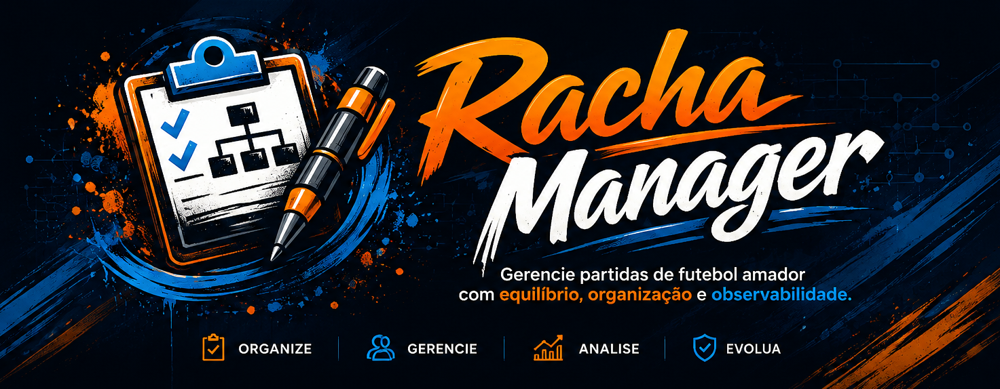
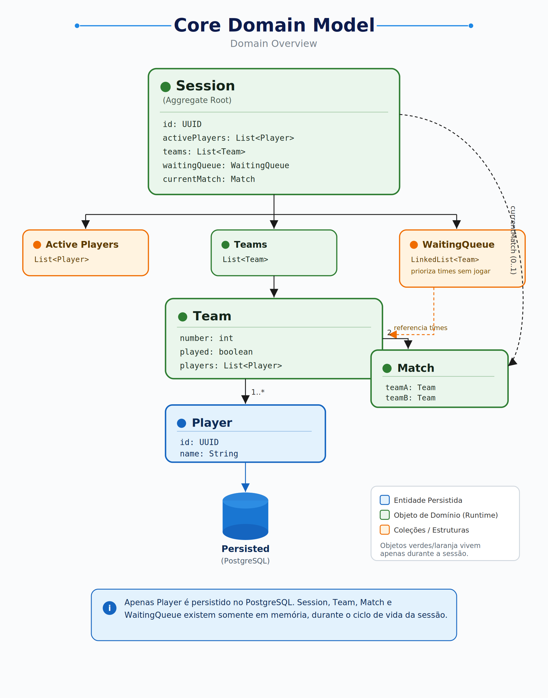
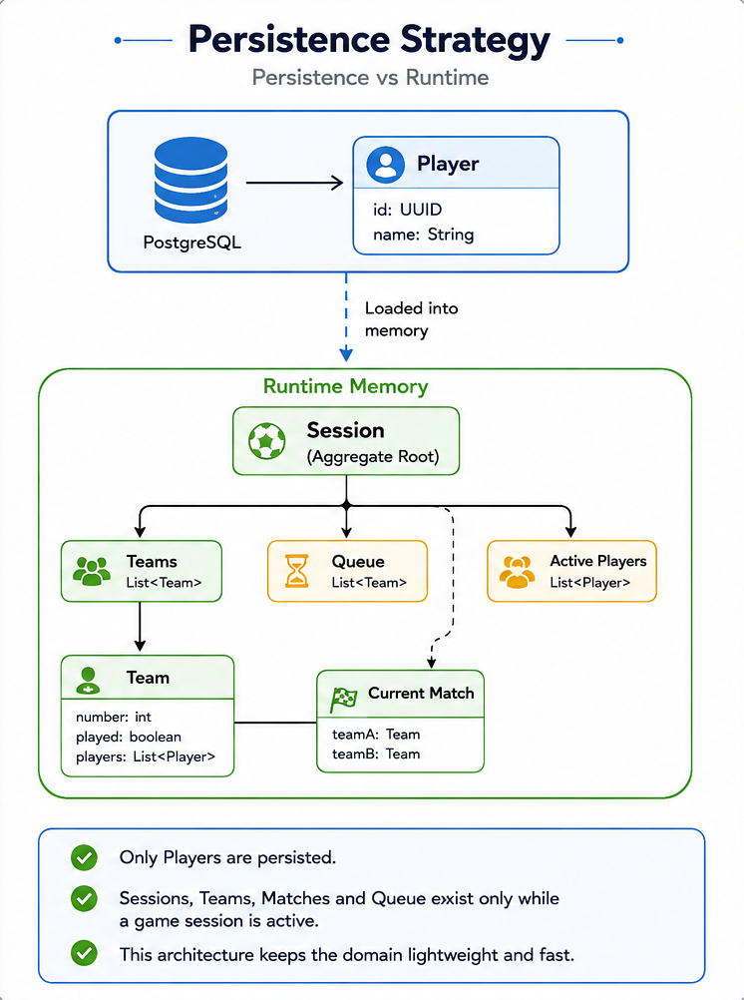
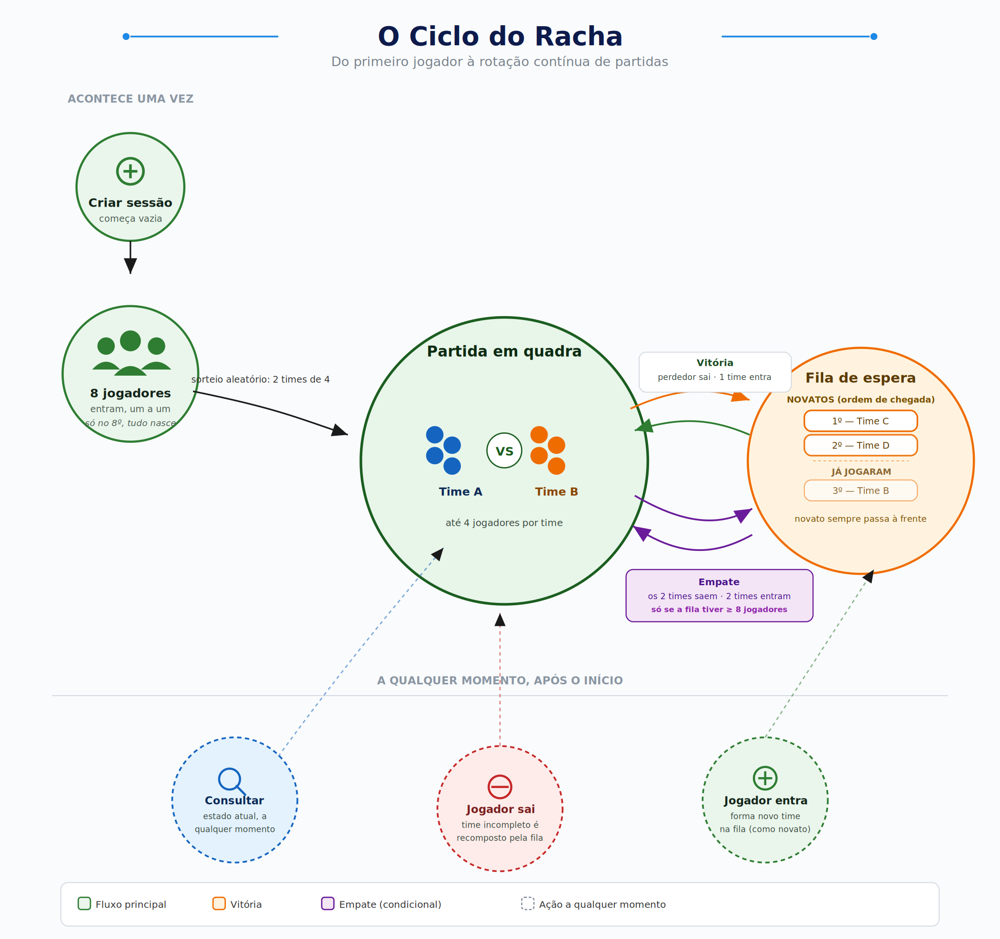

<p align="center">
  
</p>

<h1 align="center">Racha Manager</h1>

<p align="center">
API REST para gerenciamento inteligente de equipes, jogadores e partidas esportivas amadoras.
</p>

<p align="center">
  
  
  
  
  
  
  
  
  
  
  
</p>

---

# 📌 Sobre o projeto

O **Racha Manager** é uma **API REST** desenvolvida para automatizar a organização de **partidas esportivas amadoras** — os famosos "rachas" ou "peladas" de futebol —, eliminando a necessidade de controlar manualmente jogadores, equipes, filas de espera e rodadas durante uma sessão.

Além de solucionar o problema de negócio, o projeto foi concebido como um estudo aprofundado em **engenharia de software**, priorizando arquitetura orientada ao domínio (DDD), boas práticas de desenvolvimento, testes automatizados — incluindo testes de concorrência —, conteinerização, integração contínua (CI) e publicação em ambiente de produção na **AWS (EC2)**.

---

# 🎯 Problema

Organizar um racha entre amigos parece simples, mas rapidamente vira uma fonte de atrito quando feito manualmente:

- quem já jogou e quem ainda está esperando a vez;
- como formar times de maneira aleatória e equilibrada, sem depender de alguém decidindo manualmente quem joga com quem;
- o que fazer quando um time fica incompleto porque alguém saiu no meio do jogo;
- quem entra na quadra quando a partida termina;
- e tudo isso precisa ser recalculado toda vez que alguém entra ou sai da pelada.

Sem um sistema que centralize essas regras, a organização acaba dependendo da memória e da boa vontade de quem está "controlando o jogo" — e erros de contagem, discussões sobre times e filas desorganizadas são praticamente garantidos à medida que o número de jogadores cresce.

---

# 💡 Solução

O Racha Manager centraliza toda essa lógica em uma única API, automatizando decisões que antes exigiam controle manual constante:

- criação e gerenciamento de sessões de jogo;
- entrada e saída dinâmica de jogadores, a qualquer momento;
- formação automática dos times iniciais assim que jogadores suficientes se juntam;
- fila de espera com priorização — times que ainda não jogaram entram na frente dos que já jogaram;
- rotação automática de partidas: o time vencedor permanece em quadra, o perdedor vai para o fim da fila;
- recomposição automática de times incompletos, puxando jogadores da fila quando necessário;
- proteção contra condições de corrida (*race conditions*) quando múltiplas requisições atingem a mesma sessão simultaneamente, validada com testes de concorrência reais;
- documentação interativa via Swagger;
- ambiente totalmente containerizado com Docker.

---

# 🚀 Tecnologias utilizadas

| Categoria        | Tecnologias                              |
|-------------------|-------------------------------------------|
| Arquitetura       | DDD tático (Aggregate Root, Rich Domain Model) |
| Linguagem         | Java 21                                    |
| Framework         | Spring Boot                                |
| Banco de Dados    | PostgreSQL                                 |
| Persistência      | Spring Data JPA / Hibernate                |
| Migrações         | Flyway                                     |
| Testes            | JUnit 5, Mockito, testes de concorrência (`ExecutorService` + `CountDownLatch`) |
| Cobertura         | JaCoCo                                     |
| Documentação      | Swagger / OpenAPI                          |
| Containerização   | Docker + Docker Compose                    |
| Build             | Maven                                      |
| Observabilidade   | Logging estruturado                        |

---

# 🏛️ Arquitetura

O Racha Manager foi projetado seguindo princípios táticos de **Domain-Driven Design (DDD)**, buscando manter a lógica de negócio isolada da infraestrutura e modelar o domínio da forma mais próxima possível do problema real — em vez de um CRUD tradicional em torno de tabelas.

A **Session** atua como **Aggregate Root**, responsável por coordenar toda a sessão de jogo e garantir a consistência entre jogadores ativos, equipes, partida em andamento e fila de espera. Toda mutação de estado passa por métodos de negócio da própria `Session` — nenhuma coleção interna é exposta diretamente, evitando que regras sejam contornadas por acesso direto ao estado.

## Estrutura geral

A aplicação está organizada por domínio de negócio, não por camada técnica:

```text
src/main/java/com/fcolucasvieira/racha_manager
├── common       # exceptions, response padrão, observability
├── config       # configurações gerais (Swagger, etc.)
├── player       # cadastro de jogadores
└── session      # núcleo do domínio: sessões, times, partidas, fila de espera
```

Dentro de `session` e `player`, cada módulo concentra seus próprios `controller`, `dto`, `model`, `repository`, `service` e `usecase` — mantendo alta coesão dentro de cada domínio e reduzindo acoplamento entre eles.

## Fluxo da requisição

```
Cliente
   │
   ▼
Controller
   │
   ▼
   DTO
   │
   ▼
Use Case
   │
   ▼
Domain Model (Session / Team / Match / WaitingQueue)
   │
   ▼
Repository
```

| Camada        | Responsabilidade |
|----------------|-------------------|
| Controller     | Receber e validar requisições HTTP |
| DTO            | Contrato de entrada e saída da API |
| Use Case       | Orquestrar o fluxo `buscar → decidir → alterar → salvar` |
| Domain Model   | Aplicar as regras de negócio e proteger invariantes |
| Repository     | Persistir o estado — em memória para `Session`, no PostgreSQL apenas para `Player` |

## Modelo de Domínio

<p align="center">
  
</p>

O modelo de domínio foi construído tendo a **Session** como entidade central, responsável por:

- gerenciar os jogadores ativos da sessão;
- organizar automaticamente as equipes;
- controlar a fila de espera (`WaitingQueue`), priorizando times que ainda não jogaram sobre os que já jogaram;
- coordenar a partida em andamento;
- garantir a consistência de toda a sessão de jogo.

## Estratégia de Persistência

<p align="center">
  
</p>

Uma das principais decisões arquiteturais deste projeto foi separar claramente o que pertence à **persistência** do que pertence apenas ao **estado de execução da aplicação**.

| Persistido | Runtime         |
|------------|-----------------|
| ✅ Player  | ✅ Session       |
|            | ✅ Team          |
|            | ✅ Match         |
|            | ✅ WaitingQueue  |

### 💡 Por que essa decisão?

O foco da versão atual é o **gerenciamento de partidas em tempo real**, não o armazenamento de histórico. Como sessões, equipes, partidas e filas têm ciclo de vida temporário, persistir essas estruturas aumentaria a complexidade sem gerar benefício para os requisitos atuais — e mantém o domínio enxuto, rápido e fácil de evoluir (ver [Roadmap](#️-roadmap)).

---

# 🧵 Concorrência

Como múltiplas requisições podem tentar alterar a **mesma sessão** ao mesmo tempo — por exemplo, dois jogadores entrando simultaneamente —, o `Session` é protegido contra **race conditions** usando `synchronized` nos *use cases* que executam o fluxo `buscar → decidir → alterar → salvar`.

Essa proteção foi validada com **testes de concorrência reais**, que disparam múltiplas threads simultâneas contra a mesma sessão (`ExecutorService` + `CountDownLatch`) e garantem que o estado final permanece consistente — sem jogadores duplicados, sem times criados em duplicidade e sem exceptions inesperadas.

> 💡 Essa solução é intencionalmente pensada para a versão atual (estado em memória, instância única). Na evolução com **Redis**, a estratégia de lock será migrada para um **distributed lock**, já que `synchronized` não protege estado compartilhado entre múltiplas instâncias da aplicação.

---

# ☁️ Deploy

A aplicação está publicada em produção na **AWS (EC2 + Docker)**.

[](http://35.171.106.158:8080/swagger-ui/index.html)

Infraestrutura: Instância EC2 (Ubuntu), aplicação e banco rodando via `docker compose --profile app`, IP Elástico fixo, Security Group restringindo o Postgres ao acesso interno da rede Docker (porta 5432 nunca exposta publicamente). Detalhes de como reproduzir esse setup estão na seção [Como rodar localmente](#-como-rodar-localmente) abaixo.

---

# ⚙️ Como rodar localmente

## Pré-requisitos

- Java 21
- Docker e Docker Compose
- Maven (ou use o `./mvnw` incluso no projeto)

## Clonando o repositório

```bash
git clone https://github.com/fcolucasvieira/racha-manager.git
cd racha-manager
```

## Configurando as variáveis de ambiente

Copie o arquivo de exemplo e ajuste se necessário:

```bash
cp .env.example .env
```

| Variável      | Descrição              | Valor padrão    |
|---------------|--------------------------|------------------|
| `DB_PORT`     | Porta do PostgreSQL      | `5432`           |
| `DB_NAME`     | Nome do banco de dados   | `racha_manager`  |
| `DB_USER`     | Usuário do banco         | `postgres`       |
| `DB_PASSWORD` | Senha do banco           | `postgres`       |

## Subindo o banco de dados

```bash
docker compose up -d postgres
```

## Executando a aplicação

```bash
./mvnw spring-boot:run
```

A aplicação ficará disponível em `http://localhost:8080`.

## Executando via Docker (opcional)

```bash
docker compose --profile app up -d
```

Sobe o PostgreSQL e a aplicação juntos, dispensando o passo anterior.

> 📊 **Observabilidade:** a stack de Prometheus/Grafana está presente na infraestrutura (`docker compose --profile app --profile observability up -d`), mas ainda não está estabilizada — é um ajuste previsto para uma próxima versão. Hoje a aplicação conta com logging estruturado como principal ferramenta de observabilidade.

## Executando os testes

```bash
./mvnw test
```

---

# 📡 Endpoints principais

Documentação interativa completa disponível via Swagger, em `/swagger-ui/index.html` ao rodar localmente.

### Sessões

| Método   | Endpoint                                   | Descrição                                         |
|----------|---------------------------------------------|----------------------------------------------------|
| `POST`   | `/sessions`                                 | Cria uma nova sessão de jogo                        |
| `GET`    | `/sessions/{sessionId}`                     | Consulta o estado atual de uma sessão               |
| `POST`   | `/sessions/{sessionId}/players/{playerId}`  | Adiciona um jogador à sessão                        |
| `DELETE` | `/sessions/{sessionId}/players/{playerId}`  | Remove um jogador da sessão                         |
| `POST`   | `/sessions/{sessionId}/finish-match`        | Finaliza a partida em andamento (vitória/empate)    |

### Jogadores

| Método | Endpoint    | Descrição                                  |
|--------|-------------|----------------------------------------------|
| `POST` | `/players`  | Cadastra um novo jogador                      |
| `GET`  | `/players`  | Lista os jogadores cadastrados (paginado)     |

---

# 🔄 Fluxo de uma sessão completa

<p align="center">
  
</p>

---

# 🧪 Qualidade e Testes

O projeto conta com cobertura de testes acima de 85% (JaCoCo), incluindo:

- testes unitários de modelo de domínio, serviços e *use cases*;
- testes de integração dos controllers;
- **testes de concorrência**, com múltiplas threads reais (`ExecutorService` + `CountDownLatch`), validando a proteção contra *race conditions* no `Session`.

```bash
./mvnw test
```

---

# 🗺️ Roadmap

- 🔐 Autenticação e autorização
- 🧠 Redis para persistência distribuída do estado da sessão (com TTL de 24h)
- 🔒 Distributed lock (Redisson) substituindo o `synchronized` local, para suportar múltiplas instâncias
- 🧹 Expiração automática de sessões inativas
- ⚽ Generalização das regras para N times e M jogadores por time (hoje fixo em 4x4)
- 🤖 Pipeline de CI (GitHub Actions) rodando os testes a cada push

---

# 👨‍💻 Autor

**Lucas Vieira**:
Estudante de Engenharia de Computação — UFC Sobral

- GitHub: [github.com/fcolucasvieira](https://github.com/fcolucasvieira)
- LinkedIn: [linkedin.com/in/fco-lucas-vieira](https://www.linkedin.com/in/fco-lucas-vieira/)